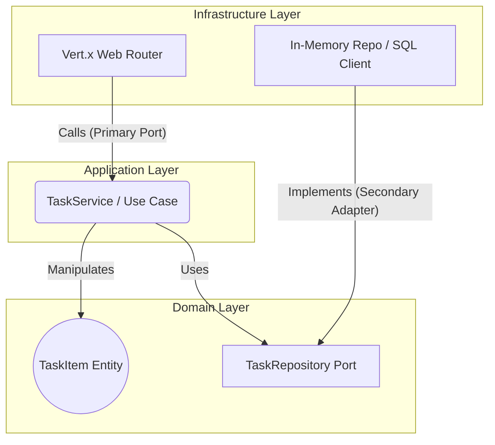

# Vert.x Hexagonal Architecture Template ☕️🏗️

A production-ready boilerplate for building highly scalable, reactive microservices in Java. This project demonstrates how to marry the ultra-high performance of Eclipse Vert.x with the maintainability of strict Domain-Driven Design (DDD) and Hexagonal Architecture (Ports and Adapters).

## Architecture: Ports and Adapters

## Stack & Design Principles
- **Domain:** Pure Java (`TaskItem` entity + `TaskRepository` interface). Zero framework dependencies.
- **Application:** Use cases orchestrating the business logic (`TaskService`).
- **Infrastructure:** HTTP delivery mechanism (Vert.x Web) and data persistence.
- **Reactive Core:** Fully non-blocking event loop utilizing Eclipse Vert.x and RxJava2.
- **SOLID Principles:** Adherence to Open/Closed Principle (OCP) and Liskov Substitution Principle (LSP) in adapters.

## Endpoints
- `GET /health`
- `POST /tasks` body `{"title":"..."}`
- `GET /tasks`

## Local Setup
\`\`\`bash
docker compose up --build
\`\`\`
- API: `http://localhost:8081`

## Tests
\`\`\`bash
./gradlew test
\`\`\`
