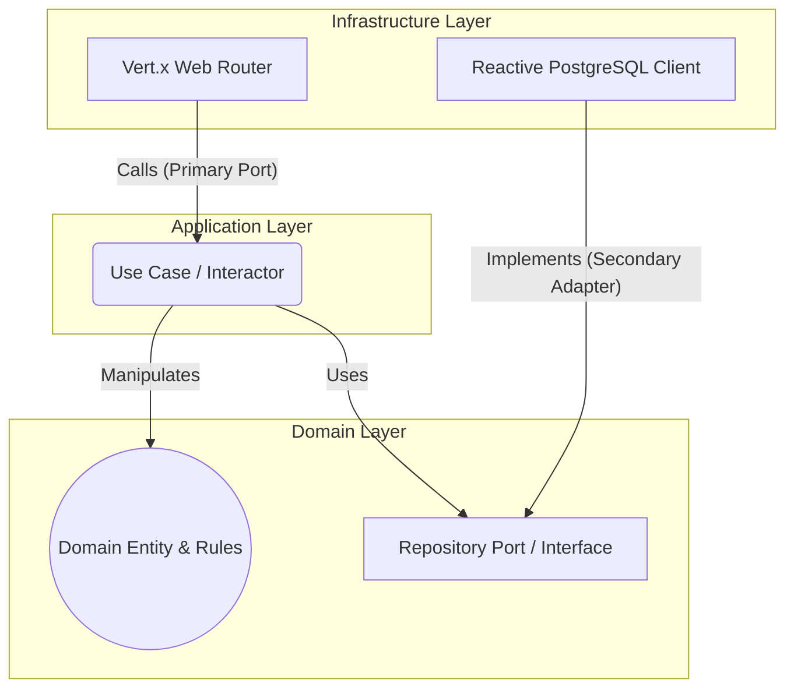

# Vert.x Hexagonal Architecture Template ☕️🏗️

A production-ready boilerplate for building highly scalable, reactive microservices in Java. This project demonstrates how to marry the ultra-high performance of Eclipse Vert.x with the maintainability of strict Domain-Driven Design (DDD) and Hexagonal Architecture (Ports and Adapters).

## The Goal
To provide a template that prevents framework lock-in and "spaghetti code", ensuring that the core business rules remain pure, testable, and isolated from HTTP delivery mechanisms or database implementations.

## Architecture: Ports and Adapters

## Key Technologies & Design Principles
- **Reactive Core:** Fully non-blocking event loop utilizing Eclipse Vert.x and RxJava2 (`Single`, `Completable`, `Observable`).
- **Domain-Driven Design (DDD):** 
  - Rich Domain Models (no anemic entities).
  - Explicit Bounded Contexts, Aggregates, and Value Objects.
- **SOLID Principles:**
  - **Open/Closed Principle (OCP):** New infrastructure adapters (e.g., changing from Postgres to MongoDB) can be added without modifying the Domain.
  - **Liskov Substitution Principle (LSP):** Infrastructure adapters perfectly fulfill Domain interface contracts.
- **Clean Code:** Immutability by default (using `final` and records), fail-fast validation in Value Objects, and dependency injection via Dagger 2.

## Local Setup
\`\`\`bash
# 1. Clone the repository
git clone https://github.com/yourusername/vertx-hexagonal-template.git
cd vertx-hexagonal-template

# 2. Build and run via Gradle
./gradlew clean run
\`\`\`
